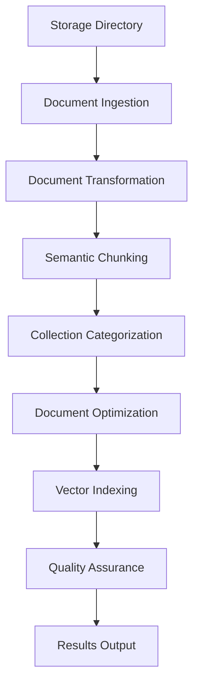

# RAG Preprocessing Pipeline Flow

This document explains the step-by-step flow of the RAG preprocessing pipeline, from raw documents to indexed vector embeddings.

## 🎯 Overview

The pipeline transforms raw restaurant data into searchable vector embeddings stored in specialized Astra DB collections.



## 📁 Input Data Structure

```
storage/
├── pdf/        
│   ├── american.pdf
│   ├── chinese.pdf
│   ├── french.pdf
│   ├── indian.pdf
│   ├── italian.pdf
│   ├── japonese.pdf
│   ├── mexican.pdf
│   └── thai.pdf
├── json/       
│   └── restaurants.json
├── csv/        
│   └── coupons_2025-07-31.csv
└── doc/        
    └── allergy.docx
```

## 🔄 Pipeline Execution Flow

### Step 1: Document Ingestion
**File**: `ingestion.py` | **Class**: `DocumentIngestor`

```python
def ingest_all() -> List[Document]:
```

**Process**:
1. **PDF Ingestion** (`_ingest_pdfs`)
   - Uses `SimpleDirectoryReader` to load PDFs
   - Extracts restaurant name from filename
   - Adds `file_type: "pdf"` and `source_dir: "pdf"`

2. **JSON Ingestion** (`_ingest_json`)
   - Loads `restaurants.json`
   - Truncates large content to 1500 characters + "... [truncated]"
   - Creates one document per JSON object/array item
   - Adds `file_type: "json"` and `source_dir: "json"`

3. **CSV Ingestion** (`_ingest_csv`)
   - Reads CSV with pandas
   - Creates one document per row
   - Converts each row to JSON format
   - Adds `file_type: "csv"` and `source_dir: "csv"`

4. **DOCX Ingestion** (`_ingest_docx`)
   - Uses `DocxReader` from LlamaIndex
   - Extracts text content
   - Adds `file_type: "docx"` and `source_dir: "doc"`

5. **Markdown Ingestion** (`_ingest_markdown`)
   - Scans for `.md` files recursively
   - Loads with `SimpleDirectoryReader`
   - Adds `file_type: "markdown"`

**Output**: ~99 documents with basic metadata

---

### Step 2: Document Transformation
**File**: `transformer.py` | **Class**: `DocumentTransformer`

```python
def __call__(nodes: List[Document]) -> List[Document]:
```

**Process**:

1. **Text Cleaning** (`_clean_text`)
   - Normalizes whitespace: `\s+` → single space
   - Removes special characters except: `\w\s\-\$\.\,\:\;\!\?\(\)\[\]\/`
   - Removes excessive newlines

2. **Section Normalization** (`_normalize_sections`)
   - Standardizes menu section names:
     - `appetizer` → `APPETIZERS`
     - `entree/main` → `MAIN COURSES`
     - `dessert` → `DESSERTS`
     - `beverage/drink` → `BEVERAGES`

3. **Currency Standardization** (`_standardize_currency`)
   - Converts all prices to `$XX.XX` format
   - Extracts price statistics: `min_price`, `max_price`, `avg_price`

4. **Dietary Label Extraction** (`_extract_dietary_labels`)
   - Detects dietary keywords: vegetarian, vegan, gluten-free, etc.
   - Stores as comma-separated string in `dietary_labels`

5. **Menu Item Parsing** (`_extract_menu_items`)
   - Uses regex: `([A-Z][^$\n]*?)\s*\$(\d+(?:\.\d{2})?)`
   - Extracts dish names and prices
   - Creates structured menu items list

6. **Restaurant Info Enrichment** (`_enrich_restaurant_info`)
   - Extracts restaurant name from document content
   - Creates normalized version: lowercase with underscores

7. **Cuisine Detection** (`_enrich_cuisine_type`)
   - Keyword-based cuisine classification
   - Supports: Italian, Chinese, Japanese, Mexican, Indian, Thai, French, American
   - Calculates confidence score

8. **Price Categorization** (`_enrich_price_range`)
   - `< $15` → `budget`
   - `$15-30` → `moderate`
   - `$30-50` → `upscale`
   - `> $50` → `luxury`

9. **Dietary Info Enhancement** (`_enrich_dietary_info`)
   - Comprehensive dietary option detection
   - Sets `dietary_friendly` boolean flag

10. **Search Tag Generation** (`_add_search_tags`)
    - Creates filterable tags: `section:appetizers`, `cuisine:italian`, etc.
    - Stored as comma-separated string

11. **Metadata Length Validation** (`_validate_metadata_length`)
    - Enforces 800-character metadata limit for Astra DB
    - Removes non-critical fields if needed
    - Truncates long text fields

**Output**: ~99 documents with rich metadata (20+ fields per document)

---

### Step 3: Semantic Chunking
**File**: `chunking.py` | **Class**: `SmartChunker`

```python
def chunk_documents(documents: List[Document]) -> List[Document]:
```

**Process**:

1. **Document Classification**
   - **Menu Item Documents** (`_is_menu_item_doc`): Contains `$` prices
   - **Structured Documents** (`_is_structured_doc`): Has section headers
   - **Standard Documents**: Everything else

2. **Menu-Aware Chunking** (`_chunk_by_menu_items`)
   - Splits by menu sections first
   - Groups 2 menu items per chunk
   - Preserves dish names and prices together
   - Adds `chunk_type: "menu_items"`

3. **Section-Based Chunking** (`_chunk_by_sections`)
   - Splits on section boundaries
   - Large sections get further chunked
   - Adds `chunk_type: "section_complete"` or `"section_part"`

4. **Semantic Chunking** (Optional)
   - Uses `SemanticSplitterNodeParser` with OpenAI embeddings
   - 95% similarity threshold for splits
   - Maintains semantic coherence

**Configuration**:
- `chunk_size`: 350 tokens
- `chunk_overlap`: 50 tokens
- `use_semantic`: True (default)

**Output**: ~155 chunks (1.6 chunks per document average)

---

### Step 4: Collection Categorization
**File**: `indexer.py` | **Method**: `categorize_documents`

```python
def categorize_documents(documents) -> Dict[str, List[Document]]:
```

**Collection Mapping**:

| Source | File Type | Collection | Purpose |
|--------|-----------|------------|---------|
| `pdf/` | `pdf` | `menus` | Menu content with dishes/prices |
| `json/` | `json` | `restaurants` | Business info, hours, contact |
| `csv/` | `csv` | `coupons` | Discounts and promotions |
| `doc/` | `docx` | `allergens` | Critical safety information |

**Process**:
- Checks `file_type` and `source_dir` metadata
- Routes documents to appropriate collection
- Adds `collection_type` metadata field

**Output**: Categorized document dictionary by collection

---

### Step 5: Document Optimization
**File**: `indexer.py` | **Methods**: `_optimize_for_*`

Each collection gets specialized text optimization:

1. **Menu Optimization** (`_optimize_for_menu_search`)
   ```
   Restaurant: Bella Italia
   Cuisine: Italian
   Menu Section: MAIN COURSES
   [original text]
   Featured Dish: Margherita Pizza
   Price Range: moderate
   ```

2. **Restaurant Optimization** (`_optimize_for_restaurant_info`)
   ```
   Restaurant: Bangkok Express
   Cuisine: Thai
   Location: Downtown
   Rating: 4.5
   [original text]
   ```

3. **Coupon Optimization** (`_optimize_for_coupon_search`)
   ```
   Offer: 20% off Thai dishes
   Type: percentage_discount
   Category: restaurant
   Discount: 20%
   [original text]
   ```

4. **Allergen Optimization** (`_optimize_for_allergen_safety`)
   ```
   ALLERGEN SAFETY INFORMATION
   [original text]
   ```

**Output**: Optimized documents with enhanced searchable text

---

### Step 6: Vector Indexing
**File**: `indexer.py` | **Method**: `index_documents`

```python
def index_documents(categorized_docs) -> Dict[str, Any]:
```

**Process**:

1. **Embedding Generation**
   - Uses OpenAI `text-embedding-3-small` model
   - 1536-dimensional vectors
   - Batch size: 10 documents per API call

2. **Astra DB Storage**
   - Creates separate vector collections
   - Stores document text, embeddings, and metadata
   - Uses collection-specific configurations

3. **Error Handling**
   - Retries failed indexing (3 attempts max)
   - Handles metadata length violations
   - Reports success/failure per collection

**Collection Results**:
- `menus`: 71 documents ✅
- `restaurants`: 1 document ✅  
- `coupons`: 73 documents ✅
- `allergens`: 4 documents ✅

**Output**: 149 documents indexed across 4 collections

---

### Step 7: Quality Assurance
**File**: `quality.py` | **Class**: `PipelineTracer`

```python
def trace_step(step_name, input_data, output_data):
```

**Process**:

1. **Execution Tracing**
   - Records input/output for each step
   - Captures timing and performance metrics
   - Tracks document counts and transformations

2. **Langfuse Integration** (Optional)
   - Sends traces to Langfuse cloud platform
   - Enables real-time monitoring
   - Provides observability dashboard

3. **Quality Metrics**
   - Document processing success rates
   - Metadata completeness scores
   - Chunk size distribution analysis

**Output**: Detailed execution traces and performance metrics

---

### Step 8: Results Output
**File**: `preprocessor.py` | **Method**: `_save_results`

**Generated Files**:

1. **Results JSON** (`preprocessing_results_YYYYMMDD_HHMMSS.json`)
   ```json
   {
     "mode": "multi",
     "ingestion": { "total_documents": 99, "by_type": {...} },
     "transformation": { "processed_documents": 99 },
     "chunking": { "total_chunks": 149 },
     "indexing": { 
       "collections": {
         "menus": { "status": "success", "document_count": 71 },
         "restaurants": { "status": "success", "document_count": 1 },
         "coupons": { "status": "success", "document_count": 73 },
         "allergens": { "status": "success", "document_count": 4 }
       }
     }
   }
   ```

2. **Trace Log** (`preprocessing_traces_YYYYMMDD_HHMMSS.json`)
   - Step-by-step execution details
   - Performance timings
   - Data flow summaries

---

## 🎯 Final Output

### **Astra DB Collections**

| Collection | Documents | Optimized For | Vector Dimensions |
|------------|-----------|---------------|------------------|
| `menus` | 71 | Food similarity search | 1536 |
| `restaurants` | 1 | Business info retrieval | 1536 |
| `coupons` | 73 | Promotional search | 1536 |
| `allergens` | 4 | Safety-critical search | 1536 |

### **Enhanced Metadata Fields**

Each document contains 15-25 metadata fields:
- `restaurant`, `cuisine`, `section`, `price_category`
- `dietary_options`, `search_tags`, `min_price`, `max_price`
- `file_type`, `source_dir`, `doc_id`, `ingestion_timestamp`
- Collection-specific optimizations

### **Search Capabilities**

The processed data now supports:
- **Semantic search**: "vegetarian pasta dishes"
- **Metadata filtering**: `cuisine=italian AND price_category=moderate`
- **Collection-specific queries**: Safety info from allergen collection
- **Combined search**: Vector similarity + metadata filters

---

## 🚀 Execution Command

```bash
cd src/rag-llama-index
python preprocessor.py multi
```

**Expected Runtime**: ~5-10 minutes for full dataset
**Success Criteria**: All 4 collections show `"status": "success"`