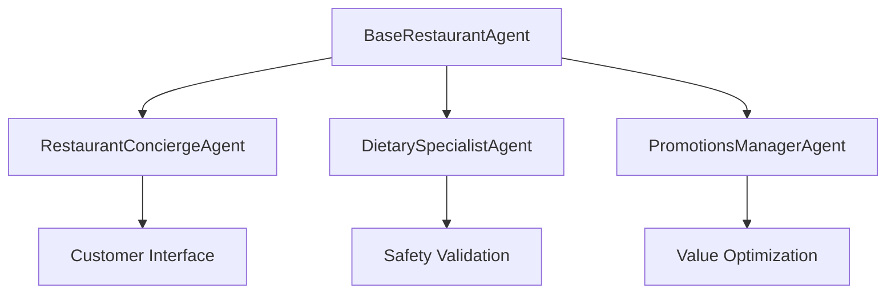

# Agents Module

## Purpose
Specialized AI agents for the restaurant recommendation system. Each agent has distinct expertise and collaborates to provide comprehensive dining recommendations while ensuring safety and value.

## Architecture
Agents follow a hierarchical structure with shared base functionality and specialized implementations:



## Agent Descriptions

### Restaurant Concierge Agent
**Role**: Customer-facing recommendation specialist
**Expertise**:
- Understanding nuanced preferences
- Matching restaurants to occasions
- Providing personalized explanations
- Suggesting alternatives

**Key Methods**:
- `recommend_restaurants()`: Generate personalized recommendations
- `explain_recommendation()`: Detailed reasoning for choices
- `suggest_alternatives()`: Backup options when needed

### Dietary Safety Specialist
**Role**: Food safety and allergen expert
**Expertise**:
- Allergen identification and risk assessment
- Cross-contamination awareness
- Dietary restriction validation
- Emergency alternative suggestions

**Key Methods**:
- `validate_dietary_safety()`: Comprehensive safety checks
- `create_safe_meal_plan()`: Complete meal planning with restrictions
- `analyze_allergen_risk()`: Risk assessment for menu items
- `emergency_alternative()`: Quick safe alternatives

### Promotions Manager
**Role**: Deal optimization specialist
**Expertise**:
- Finding active promotions
- Calculating real value
- Strategic timing recommendations
- Budget optimization

**Key Methods**:
- `find_best_deals()`: Discover optimal promotions
- `optimize_order_for_savings()`: Maximize discount usage
- `create_dining_calendar()`: Long-term deal planning
- `compare_value_propositions()`: Multi-restaurant analysis

## Usage Example

```python
from agents import (
    RestaurantConciergeAgent,
    DietarySpecialistAgent,
    PromotionsManagerAgent
)
from tools import RestaurantSearchTool, AllergenCheckerTool, CouponFinderTool

search_tool = RestaurantSearchTool()
allergen_tool = AllergenCheckerTool()
coupon_tool = CouponFinderTool()

concierge = RestaurantConciergeAgent()
dietary_specialist = DietarySpecialistAgent()
promotions_manager = PromotionsManagerAgent()

concierge_agent = concierge.create_agent([search_tool])
dietary_agent = dietary_specialist.create_agent([allergen_tool])
promotions_agent = promotions_manager.create_agent([coupon_tool])

preferences = {
    "cuisine_type": "italian",
    "price_range": "$$",
    "occasion": "anniversary"
}

recommendation = concierge.recommend_restaurants(
    "Looking for a romantic Italian restaurant",
    preferences
)
```

## Agent Collaboration

Agents can delegate tasks to each other:
1. **Concierge** finds restaurants matching preferences
2. **Dietary Specialist** validates safety for restrictions
3. **Promotions Manager** finds applicable deals
4. **Concierge** presents final recommendations

## Configuration

Agent behavior is configured through environment variables:
- `CONCIERGE_ROLE`: Role description for concierge
- `DIETARY_ROLE`: Role description for dietary specialist
- `PROMOTIONS_ROLE`: Role description for promotions manager
- `CREWAI_MAX_ITERATIONS`: Maximum reasoning iterations
- `CREWAI_MEMORY_TYPE`: Memory persistence type

## Agent Backstories

Each agent has a rich backstory that guides their behavior:
- **Concierge**: 15+ years hospitality experience
- **Dietary Specialist**: Certified nutritionist with safety focus
- **Promotions Manager**: Marketing expert with value optimization skills

## Testing

Run agent tests:
```bash
pytest agents/test_agents.py -v
```

Test individual agents:
```bash
pytest agents/test_agents.py::TestRestaurantConcierge -v
pytest agents/test_agents.py::TestDietarySpecialist -v
pytest agents/test_agents.py::TestPromotionsManager -v
```

## Performance Considerations

- Agents use GPT-4o-mini by default for cost efficiency
- Maximum iterations limited to prevent runaway processing
- Short-term memory reduces token usage
- Tool calls are optimized for minimal API usage

## Dependencies
- `crewai>=0.30.0`
- `langchain-openai>=0.1.0`
- All tool dependencies from tools module