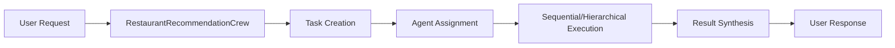

# Crews Module

## Purpose
Orchestrates multi-agent collaboration for complex restaurant recommendation workflows. Manages task delegation, agent coordination, and result synthesis.

## Architecture
The crews module implements the orchestration layer that coordinates agent interactions:



## Key Classes

### RestaurantRecommendationCrew
**Purpose**: Main crew orchestrating all agents
**Features**:
- Dynamic task creation based on user needs
- Agent coordination with dependency management
- Result aggregation and formatting
- Performance tracking

**Key Methods**:
- `recommend()`: Full recommendation workflow
- `quick_recommendation()`: Simplified fast recommendations
- `safe_dining_recommendation()`: Safety-focused workflow
- `budget_dining_recommendation()`: Deal-optimized workflow

### CrewFactory
**Purpose**: Flexible crew creation for different scenarios
**Features**:
- Pre-configured crew types
- Custom crew composition
- Dynamic agent and tool assignment

**Crew Types**:
- `FULL_SERVICE`: All agents for comprehensive recommendations
- `SAFETY_FOCUSED`: Dietary specialist primary
- `BUDGET_OPTIMIZED`: Promotions manager primary
- `QUICK_RECOMMENDATION`: Concierge only
- `CUSTOM`: User-defined configuration

## Task Workflow

### Full Recommendation Flow
1. **Search Task** (Concierge)
   - Find matching restaurants
   - Consider preferences
   - Generate initial list

2. **Safety Task** (Dietary Specialist)
   - Validate allergen safety
   - Check dietary compatibility
   - Identify safe menu items

3. **Promotions Task** (Promotions Manager)
   - Find applicable deals
   - Calculate savings
   - Optimize value

4. **Synthesis Task** (Concierge)
   - Combine all findings
   - Rank recommendations
   - Create action plan

## Usage Example

```python
from crews import RestaurantRecommendationCrew, CrewFactory, CrewType

# Option 1: Use main crew
crew = RestaurantRecommendationCrew()
result = crew.recommend(
    "Find Italian restaurant for anniversary",
    preferences={
        "cuisine_type": "italian",
        "occasion": "anniversary",
        "budget": 100,
        "allergens": ["nuts"]
    }
)

# Option 2: Use factory for specific crew type
factory = CrewFactory()
safety_crew = factory.create_crew(CrewType.SAFETY_FOCUSED)

# Option 3: Custom crew configuration
custom_crew = factory.create_crew(
    CrewType.CUSTOM,
    custom_config={
        "agents": ["concierge", "promotions"],
        "tools": ["restaurant_search", "coupon_finder"],
        "process": "sequential"
    }
)
```

## Task Dependencies

Tasks can depend on results from previous tasks:
```python
task2 = Task(
    description="...",
    agent=agent2,
    context=[task1]  # Depends on task1 results
)
```

## Process Types

### Sequential Process
- Tasks execute one after another
- Each task can access previous results
- Predictable execution order

### Hierarchical Process
- Manager agent coordinates
- Delegates to specialist agents
- Dynamic task assignment

## Performance Optimization

- **Task Batching**: Related tasks grouped for efficiency
- **Result Caching**: Common queries cached
- **Parallel Tools**: Tools can execute concurrently
- **Early Termination**: Stops if critical task fails

## Configuration

Crew behavior configured through environment:
- `CREWAI_PROCESS_TYPE`: sequential or hierarchical
- `CREWAI_MAX_ITERATIONS`: Maximum reasoning steps
- `CREWAI_MEMORY_TYPE`: Memory persistence

## Testing

Run crew tests:
```bash
pytest crews/test_crews.py -v
```

Test specific workflows:
```bash
pytest crews/test_crews.py::TestFullRecommendation -v
pytest crews/test_crews.py::TestCrewFactory -v
```

## Monitoring

Crews integrate with Langfuse for observability:
- Task execution times
- Agent interactions
- Token usage per task
- Success/failure rates

## Dependencies
- `crewai>=0.30.0`
- All agent dependencies
- All tool dependencies