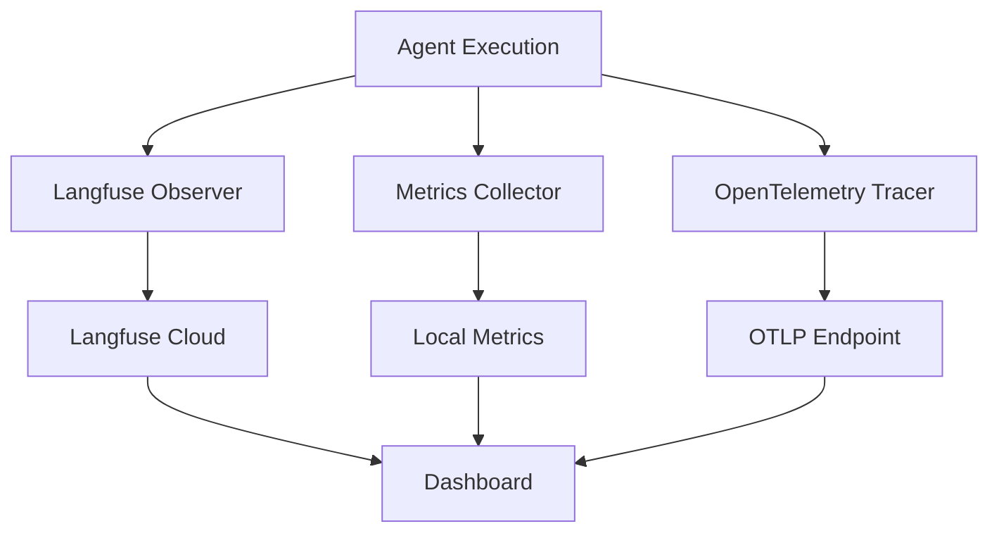

# Observability Module

## Purpose
Comprehensive monitoring and tracing for the multi-agent system. Provides real-time insights into agent performance, decision-making processes, and system health through Langfuse integration and custom metrics.

## Architecture
The observability stack integrates multiple monitoring layers:



## Key Components

### LangfuseObserver
**Purpose**: Primary observability interface with Langfuse
**Features**:
- Trace creation and management
- Span tracking within traces
- Agent execution monitoring
- Tool usage tracking
- User feedback collection
- Cost and token tracking

**Key Methods**:
- `create_trace()`: Start a new execution trace
- `track_agent_execution()`: Record agent performance
- `track_tool_usage()`: Monitor tool calls
- `track_user_feedback()`: Capture satisfaction scores

### MetricsCollector
**Purpose**: Local metrics aggregation and analysis
**Features**:
- Agent performance metrics
- Tool usage statistics
- System-level metrics
- Performance recommendations
- Time-series data collection

**Metrics Tracked**:
- Execution times
- Success/failure rates
- Token consumption
- Cost per operation
- Cache hit rates
- User satisfaction scores

### TracingConfig
**Purpose**: OpenTelemetry integration for distributed tracing
**Features**:
- Span creation and propagation
- Service mesh integration
- OTLP export support
- Context preservation

## Usage Example

```python
from observability import LangfuseObserver, MetricsCollector, trace_agent_execution

observer = LangfuseObserver()1
metrics = MetricsCollector()

with trace_agent_execution(observer, "Concierge", "Find restaurants") as trace:
    result = agent.execute(task)
    
    metrics.record_agent_execution(
        agent_name="Concierge",
        execution_time=5.2,
        tokens=1500,
        cost=0.03,
        success=True
    )

observer.track_user_feedback(
    trace_id=trace.id,
    score=0.9,
    comment="Great recommendations!"
)

report = metrics.get_performance_report()
```

## Metrics Dashboard

### Agent Metrics
- Total executions
- Success rate
- Average execution time
- Average tokens per execution
- Total cost
- User satisfaction score

### Tool Metrics
- Total calls
- Success rate
- Average response time
- Usage by agent
- Response size metrics

### System Metrics
- Uptime
- Total requests
- Overall success rate
- Cache performance
- Most active components

## Langfuse Integration

### Trace Structure
```
Trace: "Restaurant Recommendation"
├── Span: "Concierge Search"
│   ├── Generation: "LLM Call"
│   └── Tool: "restaurant_search"
├── Span: "Dietary Check"
│   ├── Generation: "LLM Call"
│   └── Tool: "allergen_checker"
└── Span: "Result Synthesis"
    └── Generation: "LLM Call"
```

### Cost Tracking
- Per-agent cost breakdown
- Token usage by model
- Cost trends over time
- Budget alerts

## Performance Recommendations

The system automatically generates recommendations:
- Low success rate alerts
- High latency warnings
- Underutilized tool notifications
- Cache optimization suggestions

## Configuration

Observability settings in environment:
```bash
LANGFUSE_PUBLIC_KEY=pk-lf-xxx
LANGFUSE_SECRET_KEY=sk-lf-xxx
LANGFUSE_HOST=https://cloud.langfuse.com
LANGFUSE_RELEASE=v1.0.0
LANGFUSE_DEBUG=false

METRICS_EXPORT_INTERVAL=60
ENABLE_METRICS=true

OTLP_ENDPOINT=https://your-collector.com
OTLP_API_KEY=your-api-key
```

## Monitoring Workflows

### Development
1. Enable debug mode
2. Use local Langfuse instance
3. Verbose logging
4. Real-time metric display

### Production
1. Batch trace export
2. Aggregated metrics
3. Alert thresholds
4. Performance baselines

## Testing

Run observability tests:
```bash
pytest observability/test_observability.py -v
```

Test components:
```bash
pytest observability/test_observability.py::TestLangfuseObserver -v
pytest observability/test_observability.py::TestMetricsCollector -v
```

## Best Practices

1. **Trace Naming**: Use descriptive, hierarchical names
2. **Metadata**: Include relevant context in traces
3. **Sampling**: Use appropriate sampling rates in production
4. **PII**: Never log personal information
5. **Retention**: Configure appropriate data retention

## Performance Impact

- **Overhead**: <5% performance impact
- **Async Export**: Non-blocking trace export
- **Batching**: Efficient data transmission
- **Local Caching**: Reduces API calls

## Dependencies
- `langfuse>=2.50.0`
- `openlit>=1.0.0`
- `opentelemetry-api>=1.24.0`
- `opentelemetry-sdk>=1.24.0`