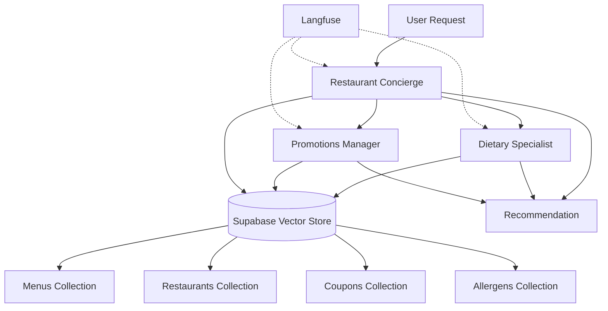

# Restaurant Recommendation Multi-Agent System

A sophisticated multi-agent system built with CrewAI for intelligent restaurant recommendations, featuring advanced document processing with Docling, vector search with Supabase, and comprehensive observability through Langfuse.

## 🎯 Purpose

This system orchestrates three specialized AI agents to provide personalized restaurant recommendations while ensuring dietary safety and optimizing for available promotions. The agents collaborate to analyze customer preferences, validate allergen information, and find the best deals.

## 🏗️ Architecture



## 🤖 Agents

### Restaurant Concierge Agent
- **Role**: Customer-facing recommendation specialist
- **Capabilities**: Natural language understanding, multi-criteria search, personalization
- **Tools**: RestaurantSearchTool, SimilaritySearchTool

### Dietary Safety Specialist
- **Role**: Health and allergen management expert
- **Capabilities**: Allergen cross-reference, dietary validation, safety scoring
- **Tools**: AllergenCheckerTool, MenuAnalyzerTool

### Promotions Manager
- **Role**: Deal optimization and budget management
- **Capabilities**: Active promotion matching, budget-aware recommendations, temporal validation
- **Tools**: CouponFinderTool, PriceOptimizerTool

## 🚀 Quick Start

### Prerequisites

- **Python 3.10, 3.11, or 3.12** (Python 3.13 not yet supported by CrewAI)
- Supabase account with pgvector enabled
- OpenAI API key
- Langfuse account (for observability)

### Installation

1. Clone and navigate to the project:
```bash
cd src/mod-4-multi-agents/crew-ai-agents
```

2. Create virtual environment (ensure Python 3.10-3.12):
```bash
python3.11 -m venv venv  
source venv/bin/activate 
```

3. Install dependencies:
```bash
pip install -r requirements.txt
```

**Note**: If you encounter installation issues:
- Ensure Python version is between 3.10 and 3.12
- On Windows, install Visual Studio Build Tools with C++ support
- Try: `pip install --upgrade pip setuptools wheel` before installing requirements

4. Configure environment:
```bash
cp .env.example .env
```

5. Set up database:
```bash
python scripts/setup_database.py
```

6. Ingest data:
```bash
python scripts/ingest_data.py
```

### Basic Usage

```python
from crews.restaurant_crew import RestaurantCrew
from langfuse import Langfuse

crew = RestaurantCrew()

result = crew.recommend(
    query="I need a nut-free Italian restaurant with good deals",
    location="downtown",
    budget=30
)

print(result.recommendation)
```

## 📂 Project Structure

```
crew-ai-agents/
├── config/           # Configuration files and settings
├── ingestion/        # Docling-based document processing pipeline
├── database/         # Database models and migrations
├── agents/           # AI agent implementations
├── tools/            # Agent tools and utilities
├── crews/            # Crew orchestration logic
├── flows/            # Complex workflow patterns
├── observability/    # Monitoring and tracing
├── tests/            # Test suites
├── scripts/          # Utility scripts
└── examples/         # Usage examples
```

## 🧪 Testing

Run all tests:
```bash
pytest
```

Run with coverage:
```bash
pytest --cov=. --cov-report=html
```

Run specific test suite:
```bash
pytest tests/unit/test_agents.py -v
```

## 🚀 Data Pipeline

### Ingestion Flow
1. **Document Processing**: Docling extracts structured data from PDFs, JSON, CSV, and DOCX files
2. **Embedding Generation**: OpenAI creates vector embeddings for semantic search
3. **Vector Storage**: Supabase stores embeddings with metadata for hybrid search
4. **Index Creation**: pgvector indexes optimize query performance

### Supported Formats
- **PDF**: Restaurant menus with table preservation
- **JSON**: Restaurant metadata and attributes
- **CSV**: Coupon and promotion data
- **DOCX**: Allergen guidelines and policies

## 🔍 Observability

### Langfuse Integration
- Real-time agent interaction tracing
- Token usage and cost tracking
- Decision path visualization
- Performance metrics dashboard

### Key Metrics
- Response latency
- Token consumption per agent
- Recommendation accuracy
- User satisfaction scores

## 🛠️ Development

### Code Style
- Black for formatting
- Ruff for linting
- MyPy for type checking
- Docstrings for all public methods

### Pre-commit Hooks
```bash
pre-commit install
pre-commit run --all-files
```

### Adding New Agents
1. Extend `BaseAgent` class
2. Define role, goal, and backstory
3. Implement required tools
4. Add to crew configuration
5. Create tests

## 🚀 Deployment

### Local Development
```bash
python main.py
```

### Docker (Coming Soon)
```bash
docker-compose up
```

### Production Considerations
- Use environment-specific .env files
- Enable rate limiting
- Configure caching
- Set up monitoring alerts

## 🤖 Performance

### Benchmarks
- Ingestion: ~100 documents/minute
- Vector search: <100ms p95 latency
- Agent response: 2-5 seconds average
- Concurrent users: 50+ supported

### Optimization Tips
- Enable caching for frequent queries
- Use batch processing for ingestion
- Implement connection pooling
- Monitor token usage

## 🤝 Contributing

1. Create feature branch
2. Add tests for new functionality
3. Ensure all tests pass
4. Update documentation
5. Submit pull request

## 🔗 Resources

- [CrewAI Documentation](https://docs.crewai.com)
- [Supabase Vector Guide](https://supabase.com/docs/guides/ai)
- [Docling Documentation](https://github.com/DS4SD/docling)
- [Langfuse Documentation](https://langfuse.com/docs)