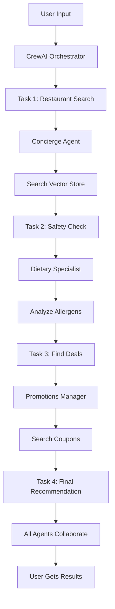

# Step-by-Step Execution Guide

## Quick Start (5 minutes)

### 1. Environment Setup
```bash
cd src/mod-4-multi-agents/crew-ai-agents
python -m venv venv
source venv/bin/activate
pip install -r requirements.txt
```

### 2. Verify Configuration
```bash
python scripts/validate_environment.py
```
✅ Should show all green checkmarks for API keys and connections

### 3. Initialize Vector Stores (First Time Only)
```bash
python scripts/setup_database.py
python scripts/ingest_data.py --all
```
✅ Processes ~200 documents into 4 vector collections

### 4. Run the Multi-Agent System
```bash
python main.py --mode interactive
```

## What Each Mode Does

### 🎯 Interactive Mode
```bash
python main.py --mode interactive
```
**What happens**: 
- Prompts for your requirements
- All 3 agents collaborate
- Shows real-time agent thinking
- Returns comprehensive recommendations

**Example Input**:
```
Enter your request: I need a vegetarian Italian restaurant with good deals for 4 people
```

### ⚡ Quick Mode
```bash
python main.py --mode quick --cuisine "Italian" --dietary "vegetarian"
```
**What happens**:
- Skips prompts, uses CLI arguments
- Focuses on speed over comprehensiveness
- Best for simple queries

### 🛡️ Safety Mode
```bash
python main.py --mode safe --allergens "peanuts,dairy"
```
**What happens**:
- Dietary Specialist leads the process
- Double-checks all allergen information
- Only recommends verified safe options
- May have fewer results but higher confidence

### 💰 Deals Mode
```bash
python main.py --mode deals --budget "$$"
```
**What happens**:
- Promotions Manager prioritized
- Sorts by best discount percentage
- Shows savings calculations
- Includes coupon codes

## Behind the Scenes Flow



## Monitoring Your Agents

### Real-time Observability
```bash
tail -f logs/app.log | grep "Agent:"
```

### Langfuse Dashboard
1. Open: https://us.cloud.langfuse.com
2. Navigate to Traces
3. Watch agents collaborate in real-time
4. See token usage and costs

## Quick Troubleshooting

| Issue | Solution |
|-------|----------|
| "No API key found" | Check `.env` file has all keys |
| "Connection refused" | Verify Supabase URL is correct |
| "No results found" | Run `python scripts/ingest_data.py --all` |
| "Timeout error" | Simplify query or increase timeout |
| "Import error" | Run `pip install -r requirements.txt` again |
| "crewai-tools not found" | Ensure Python 3.10-3.12, run `pip install crewai==0.80.0 crewai-tools==0.62.0` |
| "Build error on Windows" | Install Visual Studio Build Tools with C++ support |
| "Version conflict" | Delete venv, recreate with Python 3.11, reinstall |

## Sample Test Queries

### Simple Query
```
"Italian restaurants near downtown"
```
⏱️ ~10 seconds

### Complex Query
```
"I need a romantic French restaurant for an anniversary dinner, 
my partner is lactose intolerant, and we'd like to keep it under 
$150 for two people. Any special deals?"
```
⏱️ ~25 seconds

### Multi-Constraint Query
```
"Find me Asian fusion restaurants that are vegan-friendly, 
have gluten-free options, avoid soy, good for business lunch, 
and have at least 20% discount available"
```
⏱️ ~30 seconds

## Performance Metrics

| Operation | Time | Tokens | Cost |
|-----------|------|--------|------|
| Data Ingestion | ~2 min | ~5000 | $0.02 |
| Simple Query | ~10 sec | ~500 | $0.001 |
| Complex Query | ~25 sec | ~1500 | $0.003 |
| Full Conversation | ~2 min | ~3000 | $0.006 |

## Next Steps

1. **Customize Agents**: Edit agent backstories in `/agents/`
2. **Add More Data**: Place files in `/storage/` and re-run ingestion
3. **Tune Performance**: Adjust `CREWAI_MAX_ITERATIONS` in `.env`
4. **Scale Up**: Deploy to cloud with Docker (see `/build/`)

---

💡 **Pro Tip**: For demos, use `--mode quick` with pre-tested queries for reliable, fast results!