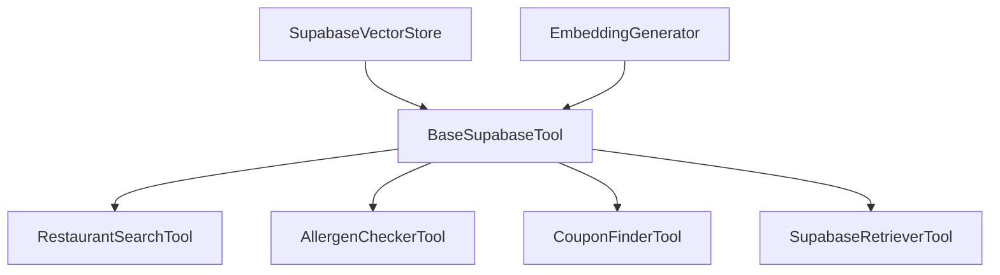

# Tools Module

## Purpose
Specialized tools that enable agents to interact with the Supabase vector store and perform domain-specific operations. Each tool provides focused functionality for restaurant search, allergen checking, and coupon discovery.

## Architecture
Tools follow a hierarchical structure with shared base functionality:



## Tool Descriptions

### BaseSupabaseTool
**Purpose**: Abstract base class providing common vector search functionality
**Features**:
- Embedding generation for queries
- Vector similarity search
- Hybrid search with metadata filtering
- Result formatting

### RestaurantSearchTool
**Purpose**: Find restaurants based on various criteria
**Capabilities**:
- Multi-criteria search (cuisine, price, location)
- Menu content search
- Rating and dietary filtering
- Combined results from multiple collections

### AllergenCheckerTool
**Purpose**: Validate food safety and check for allergens
**Capabilities**:
- Allergen detection in menu items
- Cross-contamination risk assessment
- Hidden source identification
- Safe alternative suggestions

### CouponFinderTool
**Purpose**: Discover and validate promotional offers
**Capabilities**:
- Active coupon search
- Validity date checking
- Savings calculation
- Deal optimization

### SupabaseRetrieverTool
**Purpose**: General-purpose data retrieval
**Capabilities**:
- Access any collection
- Custom metadata filtering
- Flexible result formatting
- Collection statistics

## Usage Example

```python
from tools import RestaurantSearchTool, AllergenCheckerTool

search_tool = RestaurantSearchTool()
allergen_tool = AllergenCheckerTool()

results = search_tool._run(
    query="pasta dishes",
    cuisine_type="italian",
    price_range="$$",
    min_rating=4.0
)

safety = allergen_tool._run(
    menu_item="Carbonara pasta",
    allergens_to_avoid=["eggs", "dairy"],
    restaurant_name="Luigi's"
)
```

## Tool Integration with Agents

Tools are assigned to agents based on their specialization:
- **Concierge**: RestaurantSearchTool, SupabaseRetrieverTool
- **Dietary Specialist**: AllergenCheckerTool, SupabaseRetrieverTool
- **Promotions Manager**: CouponFinderTool, RestaurantSearchTool

## Output Formatting

Tools provide rich, formatted output:
- **Emojis**: Visual indicators for categories
- **Structured Data**: Clear sections and hierarchies
- **Scores**: Relevance and confidence metrics
- **Recommendations**: Actionable suggestions

## Performance Considerations

- **Caching**: Results cached to reduce API calls
- **Batch Operations**: Multiple searches combined
- **Rate Limiting**: Respects API limits
- **Truncation**: Large results truncated for efficiency

## Testing

Run tool tests:
```bash
pytest tools/test_tools.py -v
```

Test individual tools:
```bash
pytest tools/test_tools.py::TestRestaurantSearch -v
pytest tools/test_tools.py::TestAllergenChecker -v
```

## Configuration

Tools use settings from environment:
- `SUPABASE_COLLECTION_*`: Collection names
- `OPENAI_EMBEDDING_MODEL`: Embedding model
- `RATE_LIMIT_*`: API rate limits

## Dependencies
- `crewai-tools>=0.4.0`
- `supabase>=2.5.0`
- `openai>=1.35.0`